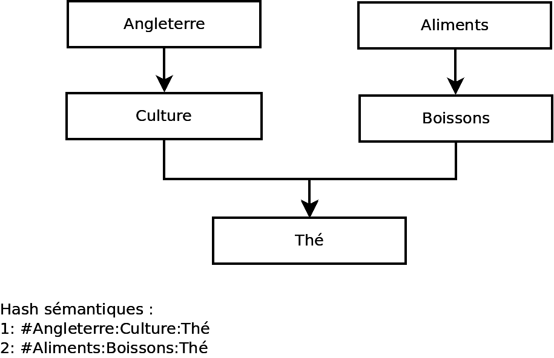

Définitions
===========

**Forum :**  

- [**meta-topic - Définition**](https://github.com/dirtylab/wiki/issues/13)
- [`label:définitions`](https://github.com/dirtylab/wiki/issues?utf8=%E2%9C%93&q=label%3Ad%C3%A9finitions+) au sujet d'une **définition**

Sommaire
--------

1. [Optique](#1)
  - [a Défi](#1.a)
  - [b Communauté](#1.b)
  - [c Qualité](#1.c)
  - [d Référence](#1.d)
  - [e Cycle de vie](#1.e)
  - [f Plateforme / Application idéale](#1.f)

2. [Créations](#2)
  - [a Post Simple](#2.a)
  - [b Post Versionné](#2.b)
  - [c Commentaire](#2.c)
  - [d Document](#2.d)
  - [e Connaissance](#2.e)
  - [f Proposition](#2.f)

3. [Politique](#3)
  - [a Modération Oligarchique](#3.a)
  - [b Modération Méritocratique](#3.b)
  - [c Modération Démocratique](#3.c)
  - [d Réputation](#3.d)
  - [e Élection](#3.e)
  - [f Vote Simple](#3.f)
  - [g Vote Catégorique](#3.g)
  - [h Filtre Catégorique](#3.h)
  - [i Rôle](#3.i)
  - [j Badges](#3.j)
  - [k Consensus tacite/implicite](#3.k)

4. [Sémantique](#4)
  - [a Explorateur Heuristique](#4.a)
  - [b Arbre sémantique](#4.b)
  - [c Hash sémantique / chemin sémantique](#4.c)
  - [d Filtre sémantique](#4.d)
  - [e Niveau de détail](#4.e)
  - [f Ontologie](#4.f)
  - [g Définitions chaînées](#4.g)
  - [h Appariement](#4.h)

5. [Versionnement](#5)
  - [a Version](#5.a)
  - [b Fusion](#5.b)
  - [c Soumission](#5.c)
  - [d Post Cible](#5.d)
  - [e Post Source](#5.e)
  - [f Hôte](#5.f)
  - [g Amendeur](#5.g)
  - [h Amendement](#5.h)
  - [i Versionnement sémantique](#5.i)

6. [Sources de données](#6)
  - [a Application Souveraine](#6.a)
  - [b Application Intégrée](#6.b)

7. [Technique](#7)
  - [a Dépôt](#7.a)

Ce corpus de définitions est là pour faciliter la communication autour du projet et se prémunir
contre les discussions à périmètre flou et autres dialogues de sourds.  
**Ce n'est pas un dictionnaire participant d'une solution cohérente, contrairement aux [Visions d'ensemble](PRATIQUE/VISIONS.MD#i-visions-densemble-ve).**

### 1. Optique
*L'optique c'est l'analyse des buts de la collaboration : dans quelle direction regardons-nous ?*

#### a. Défi
Question soumise pour l'organisateur de l'événement, ici Léo, et par extension, tous le processus d'élaboration de réponses par les participants.

#### b. Communauté
Ensemble des participants à un défi.

#### c. Qualité
La qualité, c'est dans le contexte d'un défi, notre capacité à

- **Structurer** la réponse offerte par la communauté
- Eviter autant que possible **l'écueil du nombrilisme**, qui consiste à ne pas regarder les interventions des autres participants (parfois pour plein de raisons légitimes)
- **Sourcer** un maximum les faits et théories que nous avançons avec des *références*.

#### d. Référence
C'est une source littéraire ou culturelle, logiquement associée à un post.

#### e. Cycle de vie
C'est l'ensemble des étapes aboutissant à la réponse de la *communauté* au *défi* posé par Léo. Cette définition est au coeur des différentes approches possibles, les [visions d'ensemble](#II)

#### f. Plateforme / Application idéale

C'est une application, pour le moment abstraite, qui réunira un ensemble de fonctionnalités adressant différents besoins et eccueils de la collaboration en ligne. 
Ses [spécifications](PRATIQUE/SPECIFICATIONS.MD) vont s'élaborer progressivement, à mesure que la communauté adopte des fonctionnalités. A terme, elle sera **la fusion** de **plusieurs visions partielles**, vidions d'**ensemble** et **preuves de concept** si un consensus est trouvé. L'exploration de [pistes](THEORIE/PISTES.MD) devra aussi nous aider à éclairer nos choix de fonctionnalités.

### 2. Créations
*Ce que la communauté créée*

#### a. Post Simple
Texte structuré qui répond au *défi*, éditable par son auteur seulement.

#### b. Post Versionné
Document collaboratif qui offre une réponse possible au *défi*. Se référer à [versionnement](#V) pour plus de détails.
**Problème** : comment correctement circonscrire le périmètre de la réponse ?

#### c. Commentaire
Observation, critique, avis fait sur un *post*. Ce n'est pas un document collaboratif.

#### d. Document
Production quelconque référencée ou fournie par la communauté.
Ce peut être une vidéo, un *post*, un article, une page web interactive, un gif...  
>   
*Gif référencé par le chemin sémantique `#Mind:Nuclear:Explosion`*

#### e. Connaissance
Dans le cadre d'un défi, élément de réponse **servant la compréhension**, que souhaite partager un *membre* avec la *communauté*.
**Ex** :  une synthèse sur les ontologies

#### f. Proposition
Dans le cadre d'un *défi*, élément de réponse **servant un but** inféré - déduit - de la problématique, que souhaite partager un *membre* avec la *communauté*.  
**Ex** : une fonctionnalité de l'application

### 3. Politique
*La politique, c'est le filtrage des contenus produits par la communauté pour qu'ils s'alignent avec certains impératifs comme le respect de la loi ou l'exigence de qualité tout en garantissant une libre expression de ses membres.*  
**Remarque** : les définitions qui suivent ne s'excluent pas les unes des autres.

#### a. Modération oligarchique
Le choix des modérateurs se fait par l'ultime souverain : Léo.

#### b. Modération méritocratique
Le choix des modérateurs se fait par *réputation*.

#### c. Modération démocratique
Le choix des modérateurs se fait par *élection*.  

#### d. Réputation
La réputation, c'est une métrique (un score) qui est d'autant plus grand que le membre est apprécié de la communauté, ce sont les *votes* qui affectent cette métrique.

#### e. Élection
Une élection est l'attribution d'un rôle (ex modérateur) par le résultat d'un vote de la communauté, pour une durée finie (mandat).

#### f. Vote Simple
Un vote simple est exactement comme lorsqu'on donne un pouce sur Facebook ou YouTube.

#### g. Vote Catégorique
Un vote catégorique est comme un vote simple à la différence près que le votant a plusieurs choix. Il donne l'avantage de pouvoir créer des *filtres catégoriques* et d'avoir un système de réputation plus fin.  
> Ex : Pas bête, Drôle, Impertinent, Spam, Troll ...

#### h. Filtre catégorique
Un filtre catégorique permet à l'utilisateur de l'application de ne sélectionner que les posts « Pas bête », « Drôle », « Impertinent », etc.

#### i. Rôle
Un *Rôle* est une mission assumée par un membre le temps d'un *défi*.
> Ex : Aggrégateur de [*références*](#1.d)

#### j. Badge
Distinction récompensant l'investissement et la bonne volonté d'un participant.
Exemples (proposés par [Gophys](https://github.com/Gophys)) :

* **Policier**: personne mettant en avant les comportements non respectueux
* **Expert**: personne proposant de nouvelles solutions ou des modifications pertinentes dans un domaine particulier
* **Journaliste**: personne donnant souvent un « pouce levé » aux nouvelles idées/modifications, avant d'être suivie par la foule

#### k. Consensus tacite/implicite - Lazy consensus
Processus de décision simple consistant à suivre les étapes suivantes :

* Proposition
* Discussion
* Vote (si aucun consensus n'est obtenu suite à discussion)
* Décision

Le consensus est *implicite* dans le sens où ceux qui n'auraient pas exprimé leur opinion au delà d'une certaine durée,
acceptent *implicitement* la décision. Cf. inspiration [sur le Wiki GitHub du projet Xerte Online Toolkits](https://github.com/thexerteproject/xerteonlinetoolkits/wiki/6.-Decision-Making-Process)

### 4. Sémantique
*La sémantique, c'est l'étude du sens. Dans le contexte d'une application web, l'exemple le plus parlant est l'utilisation de hash tags `#` dans twitter pour regrouper un ensemble de publications.*

#### a. Explorateur Heuristique
Schéma interactif aidant à naviguer dans les idées proposées par la communauté.
C'est une interface graphique reposant sur une [*carte heuristique / mind map*](https://fr.wikipedia.org/wiki/Carte_heuristique).  
**Ex :** carte représentant un *arbre sémantique* sur un plan permettant de naviguer entre des *documents*.

#### b. Arbre sémantique
*cf. [VP propositions Youtube : structure arborescente](PRATIQUE/VP/VP-forum-propositions-Youtube.MD#3-une-association-sémantique-des-posts)*

Vue sous forme d'arbre des *chemins / hashs sémantiques* référencés par les posts.  
**Remarque** sur la structure de données : Une feuille peut être dupliquée sur différents noeuds ! C'est pourquoi il est important de souligner ne s'agit pas d'un arbre au sens de structure de données, mais d'une *vue* de l'ensemble des chemins sémantiques assemblés en *graphe* orienté.  
**Ex :**
> ├── Ascenceurs spatiaux  
│   ├── Ascenseur  
│   ├── Skyhook  
│   └── …  
├── Propulsion  
│   ├── Capsules à explosions nucléaire  
│   ├── Fusées  
│   │   ├── Explosion  
│   │   ├── Hydrogène  
│   │   └── …  
│   └── …  
└── …

#### c. Hash sémantique / chemin sémantique
*cf. [VP propositions Youtube : hashtag avec domaine de noms](PRATIQUE/VP/VP-forum-propositions-Youtube.MD#3-une-association-sémantique-des-posts)* 

Suite ordonnée de mots caractérisant un *document* dont l'ordre d'importance est décroissant.  
C'est un peu comme un hashtag, mais "augmenté" : il donne une information sur la manière dont le *document* articule certains concepts entre eux.  
**Conventions syntaxiques:**

- Chaque feuille est séparée de son noeud par un `:`
- La racine du chemin est identifiée par un `#`

**Ex :**

1. `#Allemagne:Artisanat:Bière` **se distingue de**
2. `#Bière:Artisanat:Allemagne` **dans l'importance que l'article donne aux termes énumérés**.

Dans le cas n° 1, L'article aborde d'abord l'Allemagne et mentionne brièvement sa production de bière dans un paragraphe dédié à son Artisanat.  
Dans le cas n°2, l'article traite d'abord de la bière, puis de sa production artisanale et éventuellement mentionne l'Allemagne.

**Remarque :** Un tel chemin **caractérise l'articulation proposée par un document** (un *post* par exemple, voire un chapitre), **et pas la relation ontologique entre les termes du chemin**. Un document (ou section de document) peut être carractérisé par plusieurs chemins.

#### d. Filtre sémantique
Expression textuelle permettant de filtrer les posts suivant les noeuds sélectionnés.  
Reprend les conventions syntaxique d'un *hash sémantique*.  
**Ex :**
> `#Propulsion:Fusées`

Affiche tous les posts référés dans le chemin `Propulsion:Fusées`.  

**Remarque** :  
> `#Fusées`

Va agréger (fusionner) les résultats de tous les noeuds appellés `Fusées`
#### e. Niveau de détail
Au sujet d'une représentation visuelle (arbre), choix des noeuds à afficher pour conserver un bon niveau de lisibilité.

#### f. Ontologie
Une [ontologie](https://fr.wikipedia.org/wiki/Ontologie_%28informatique%29) en informatique est un modèle non ambigu de description du réel.
Elle associe des concepts pour ensuite tirer des inférences.  

> [**[wikipedia]**](https://fr.wikipedia.org/wiki/Ontologie_%28informatique%29) Les ontologies décrivent généralement :

> * individus : les objets de base ;
> * classes : ensembles, collections, ou types d'objets1 ;
> * attributs : propriétés, fonctionnalités, caractéristiques ou paramètres que les objets peuvent posséder et partager ;
> *  **relations** : les liens que les objets peuvent avoir entre eux ;
> *  événements : changements subis par des attributs ou des relations ;
> * métaclasse (web sémantique) : des collections de classes qui partagent certaines caractéristiques.

#### g. Définitions chaînées
**Cet article est une ébauche en attente de validation par des spécialistes**.  
Un peu comme dans un wiki, des définitions sont référées les une aux autres par des hyperliens.
Mais à la différence d'un wiki, ces hyperliens sont qualifiées par des *relations sémantiques* et/ou par des [relations de subsomption](https://fr.wikipedia.org/wiki/Subsomption).
Les différentes natures de ces relations pourraient être (proposées par [Piratdu52](https://github.com/Piratdu52), **ceci est une ébauche!**):

>
**Spécialisation** : Pour les liens de type un carré est un rectangle. Il sera surement obligatoire de créer une balise « généralisation » simplement pour ne pas avoir la liste de tout les modelés d'avions sur la page du concept d'avion.
**Association** : Pour définir un concept n'ayant pas de nom a proprement parler, tel qu'un couple (jockey, cheval), on fait un ovale avec les concept lié entre eux , tel un graphe dans le graphe et on lie a un autre concept.
**Action**: Pour faire simple c'est le verbe d'une phrase liant deux concept, on lui passerait ce verbe en paramètre qui serait affiché dans un rectangle sur le lien.
>
**Composant** : On définit un concept faisant partie du concept courant(on peut éventuellement pointer sur un concept existant) et pouvant être amené a varier selon le cas. Tel un terrain pour une course. C'est un point d'ancrage pour la balise suivante. Si il n'est pas utilisé, on ne l'affiche pas. Sinon on affiche un triangle lié au nœud avec le nom du concept a l’intérieur.
**Variation** :On prend trois paramétrés, le concept qui varie (le terrain), le concept sur lequel il varie (course), le concept  spécialisé utilisé (piste de formule 1). On représentante ensuite le lien entre le composant et le nœud variation par un lien de type spécialisation.
>
Et une balise optionnelle :
>
**NoFollow** : Pour que le moteur ignore le lien. Utile pour pointer vers une page qui n'a pas de lien sémantique directe, par exemple pour comparer les performances de deux concept d'éclairage tel la bougie et l'ampoule.

#### h. Appariement
Dans un *arbre sémantique*, ou plus généralement dans une [taxonomie](https://fr.wikipedia.org/wiki/Taxinomie_%28homonymie%29#Informatique), c'est une unité servant à la mesure de proximité entre deux *documents*.  
On distingue :  

- **Appariement fort** : Un **chemin** complet du graphe, soit un **hash sémantique** complet est partagé entre deux items.  
**Ex :** `#Alimentation:Breuvages:Thé` partagé entre deux *posts*.  

- **Appariement faible** : Un **sommet** du graphe est partagé entre deux items.  
**Ex :**
  - *post 1* : `#Aliments:Boissons:Thé`
  - *post 2* : `#Angleterre:Culture:Thé`

>  
*Exemple d'appariement faible*

### 5. Versionnement
*Le [versionnement](https://fr.wikipedia.org/wiki/Gestion_de_versions), c'est une démarche pour organiser l'élaboration continue d'un texte avec un certain contrôle de la qualité produite afin de tendre progressivement vers un texte optimal. L'exemple le plus connu est wikipedia*

#### a. Version
Une version figée d'un [*post versionné*](#2.b), qu'on peut rétablir plus tard.
**Remarque** : Une *fusion* créée automatiquement une nouvelle version du *post cible*.

#### b. Fusion
Action de fusionner deux posts sémantiquement proches.  
*Questions* : qui propose la fusion ? Un utilisateur peut-il suggérer la fusion de deux posts qu'il trouve proches ? Peut-être une option « proposer une fusion », cette dernière devant être validée par les deux auteurs...

#### c. Soumission
*Non, pas le machin de Houellebecq*  
Action de soumettre à l'auteur d'un post une nouvelle **version** du document.

#### d. Post cible
C'est la destination, reçu par l'*hôte*, de la *fusion*.

#### e. Post source
C'est le document *amendé* (proposé par l'amendeur) de la fusion.

#### f. Hôte
Celui qui peut accepter ou refuser une *fusion* provenant d'un *amendeur* souhaitant fusionnner son *post source* avec le *post cible*.

#### g. Amendeur
Auteur d'un *amendement*.

#### h. Amendement
L'ensemble des modifications demandées par l'*amendeur* à l'*hôte*. A ne pas confondre avec la *fusion* qui est l'action d'accepter un *amendement*.

#### i. Versionnement sémantique
**[Sens 1.]** : [Spécification officielle](http://semver.org/lang/fr/) de la **V2.0**. En génie logiciel, versionnement au format **MAJEUR**.**MINEUR**.**CORRECTIF**, par exemple **1.0.1** avec :

1. **MAJEUR** : le numéro de version MAJEUR est incrémenté (augmenté de 1) s'il y a des changements rétro-incompatibles
2. **MINEUR**, le numéro de version MINEUR est incrémenté s'il y a des changements rétro-compatibles
3. **CORRECTIF**, le numéro de version de CORRECTIF est incrémenté s'il y a des corrections d’anomalies (bugs) rétro-compatibles

**[Sens 2.]** : S'applique à un *document versionné*, avec une signification analogue à [1.]. Versionnement au format **MAJEUR**.**MINEUR**.**CORRECTIF**, par exemple **1.0.1** avec :

1. **MAJEUR**, le numéro de version MAJEUR est incrémenté (augmenté de 1) si le document est fondamentalement restructuré, si son approche est sensiblement remise en question. On appelle le passage à la prochaine version majeure une **Refonte**.
2. **MINEUR**, le numéro de version MINEUR est incrémenté s'il y a des ajouts significatifs mais ne remettant pas en cause les grandes lignes abordées par le document. On appelle le passage à la prochaine version mineure une **Amélioration**.
3. **CORRECTIF**, le numéro de version de CORRECTIF est incrémenté s'il y a des corrections de syntaxe, de mise en page ou d'orthographe. On appelle le passage à la prochaine version de correctif une **Correction**.

*Exemple* : passage de la version **1.0.1** à la version **1.0.2** suite à la correction de petites fautes de syntaxe.

**PS** : *document* se veut ici être un peu plus générique que *post*. C'est une production de texte versionnée quelconque.

### 6. Sources de données
*Les sources de données mentionnées sont les sources techniques constituant l'ensemble des entités présentées [ci-dessus](#I).*

Catégorisons de types de données :

 - les données primaires :
  - Post Simple [cf 2.a](#2.a)
  - Commentaire [cf 2.c](#2.c)
 - les données d'associations sémantiques
  - Tags [cf 4.c](#4.c)
  - Structure d'arbre ou de graphe ([cf 4.a](#4.a), [4](#4.b))
  - ...*

#### a. Application souveraine
Créer une source de données spécifique et propre, une nouvelle base de donnée. Cela permettrai la mise en oeuvre de certains cas d'utilisation comme la fusion, les gestions des cycles de vies, la gestion des versions, etc...

**Avantages**

- Permet l'édition collaborative, versionnement et fusion
- Donne globalement plus de marge de manoeuvre à la gestion des contenus par l'application

**Inconvénients**

- Séparé de YouTube, effort pour le participant

#### b. Application intégrée
Utiliser pour les données primaires les commentaires de YouTube et leurs réponses. Cela limitera certain cas d'utilisation, mais cela permettra de ne pas perturber les utilisateurs de YouTube, qui pourront continuer à faire des propositions, faire leurs réponses comme d'habitude ! Les utilisateurs qui voudrons prendre du recul pourrons alors passer sur la présente application pour gérer ces commentaires, les regrouper, les tagger, etc... Les données d'associations sémantiques seraient, quant à elle, stockées spécifiquement. Ce qui est interessant c'est que cette mécanique serait accessible alors pour toutes les chaines YouTube.

On pourrait aussi imaginer une syntaxe pour que l'application « filtre » les messages qui ont un rapport, permettant par exemple une intégration avec les hashs sémantiques!

**Avantages**

- Pas de changement brutal des habitudes pour les participants
- Ouverture de la plateforme à toutes les chaines YouTube
- Authentification par YouTube ou Google+, c'est un parti pris

**Inconvénients**

- Authentification par YouTube ou Google+, c'est un parti pris
- Versionnement des posts rendu plus compliqué

### 7. Technique
*Définitions d'ordre purement technique*

#### a. Dépôt

Ensemble de fichiers constituant le code source (+ documentations, éléments graphiques...) d'un projet, généralement accessible via un [service de gestion de source](https://fr.wikipedia.org/wiki/Logiciel_de_gestion_de_versions) (git, SVN, etc.).

Sur ce site ([GitHub.com](https://github.com)), les **dépôts** sont également associés à diverses fonctionnalités complémentaires telles qu'un gestionnaire de bugs (issues), détourné en **forum** pour le cas de notre **dépôt lets-play-science**.

Un **dépôt** est également appelé couramment **repository** ou **repo**.
